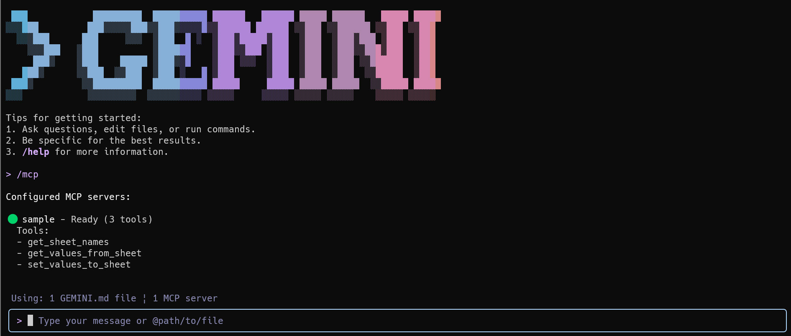
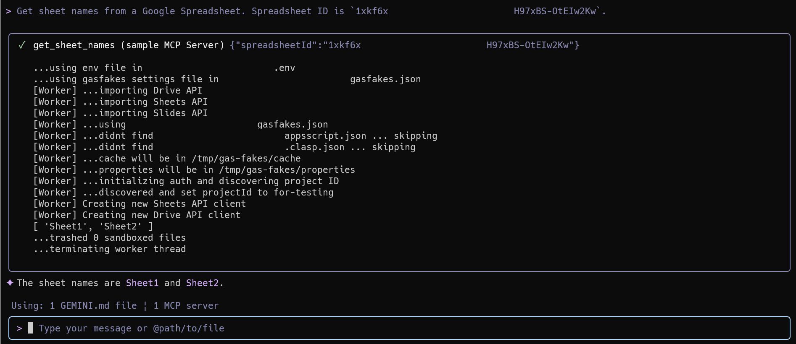
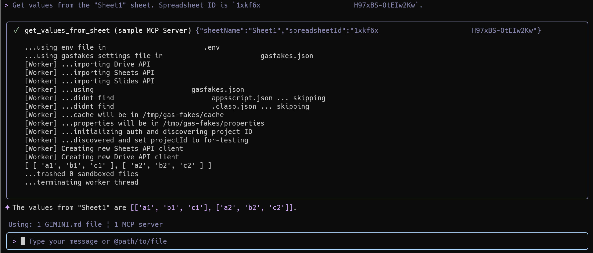
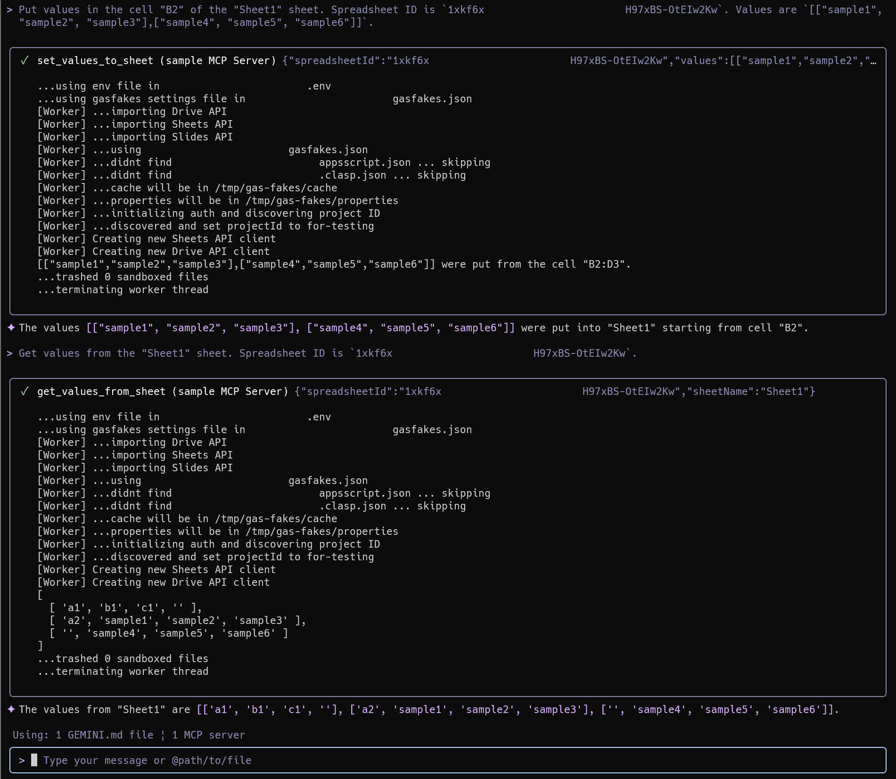

# Next-Level Google Apps Script Development


## Abstract

This article introduces a powerful method for developing and testing Google Apps Script (GAS) locally. By leveraging the `gas-fakes` library, you can build a secure, local Model Context Protocol (MCP) server, enabling the creation of AI-powered tools for Google Workspace automation without deploying to the cloud.

## Introduction

[gas-fakes](https://github.com/brucemcpherson/gas-fakes), developed by Bruce McPherson, is an innovative library that enables Google Apps Script (GAS) code to run directly in a local environment by substituting GAS classes and methods with their corresponding Google APIs.

The introduction of this library has unlocked new possibilities in GAS development. Leveraging `gas-fakes`, I have explored the following technical advancements:

1.  **A Secure Sandbox for GAS**: I reported on the feasibility of creating a secure sandbox that allows for the safe execution of code, including that generated by AI, by intentionally limiting the classes and methods available at runtime. [Ref](https://medium.com/google-cloud/a-fake-sandbox-for-google-apps-script-a-feasibility-study-on-securely-executing-code-generated-by-cc985ce5dae3)
2.  **Dynamic Tool Creation with Gemini CLI Integration**: By integrating `gas-fakes` with the `Gemini CLI`—a tool for interacting with Google's Gemini generative AI model—I demonstrated a method for dynamically creating and deleting tools for a local Model Context Protocol (MCP) server using Google Apps Script. [Ref](https://medium.com/google-cloud/dynamic-tool-creation-for-google-workspace-automation-with-gemini-cli-f9618166aaed)
3.  **An Enhanced Developer Experience with a CLI and Extension**: I developed a CLI tool and an MCP server for simply using `gas-fakes`, releasing it as a [Gemini CLI Extension](https://github.com/tanaikech/gas-development-kit-extension). This provides developers greater freedom and efficiency to run and test GAS code in their local environment. [Ref](https://medium.com/google-cloud/secure-and-streamlined-google-apps-script-development-with-gas-fakes-cli-and-gemini-cli-extension-67bbce80e2c8)

These accomplishments demonstrate that combining `gas-fakes` with generative AI holds immense potential to dramatically automate and streamline GAS development with safety ensured. This article builds upon these findings to introduce and demonstrate a method for creating tools for an MCP server with GAS locally, all while ensuring security and seamless authorization integration.

By installing and authenticating the `gas-fakes` CLI, developers can freely execute GAS code from any directory in their local environment. This execution is always performed within a secure sandbox. This framework makes it possible to rapidly develop each tool for an MCP server using GAS and run them with secure, seamless authentication.

## Prerequisites and Installation

Before building the server, you must install and configure the necessary command-line tools.

### 1. Install Gemini CLI

First, install the [Gemini CLI](https://github.com/google-gemini/gemini-cli), which allows interaction with Google's Gemini models.

```bash
npm install -g @google/gemini-cli
```

After installation, authorize the CLI by following the instructions in the [official documentation](https://github.com/google-gemini/gemini-cli?tab=readme-ov-file#-authentication-options).

### 2. Install gas-fakes CLI

Next, install [gas-fakes](https://github.com/brucemcpherson/gas-fakes), the command-line tool for executing Google Apps Script locally.

```bash
npm install -g @mcpher/gas-fakes
```

For authorization, refer to the official [Getting Started guide](https://github.com/brucemcpherson/gas-fakes/blob/main/GETTING_STARTED.md).

### 3. Verify the Installation

Confirm that the `gas-fakes` CLI is installed correctly by checking its help message:

```bash
gas-fakes --help
```

Next, test your authorization by running a simple script to retrieve the name of your Google Drive's root folder:

```bash
gas-fakes -s "const rootFolder = DriveApp.getRootFolder(); const rootFolderName = rootFolder.getName(); console.log(rootFolderName);"
```

If the command successfully prints the folder name, your installation and authentication are working correctly.

## Building the MCP Server

With the tools installed, you can now build the local MCP server.

### 1. Set Up the Project Directory

Create a working directory for your project and install the required Node.js modules for the MCP server.

```bash
mkdir sample
cd sample
npm install @modelcontextprotocol/sdk zod
```

All subsequent files in this guide will be created inside this `sample` directory.

### 2. Create Google Apps Script Tools

These JavaScript files will serve as the individual tools for your MCP server.

#### Get Sheet Names from a Spreadsheet

Create `get_sheet_names.js`:

```javascript
/**
 * Gets sheet names from a Google Spreadsheet.
 * @param {Object} object
 */
function myFunction(object = {}) {
  if (object.spreadsheetId) {
    const spreadsheet = SpreadsheetApp.openById(object.spreadsheetId);
    const sheetNames = spreadsheet.getSheets().map((sheet) => sheet.getName());
    console.log(sheetNames);
  } else {
    console.error("error: Spreadsheet ID was not found.");
  }
}

// The variable name "args" is fixed for passing arguments.
myFunction(args);
```

#### Get Values from a Spreadsheet

Create `get_values_from_sheet.js`:

```javascript
/**
 * Gets values from a Google Spreadsheet.
 * @param {Object} object
 */
function myFunction(object = {}) {
  const { spreadsheetId, sheetName, range } = object;
  if (spreadsheetId && sheetName) {
    const spreadsheet = SpreadsheetApp.openById(spreadsheetId);
    const sheet = spreadsheet.getSheetByName(sheetName);
    const values = range
      ? sheet.getRange(range).getDisplayValues()
      : sheet.getDataRange().getDisplayValues();
    console.log(values);
  } else {
    console.error("error: Spreadsheet ID or Sheet name were not found.");
  }
}

// The variable name "args" is fixed for passing arguments.
myFunction(args);
```

#### Put Values into a Spreadsheet

Create `set_values_to_sheet.js`:

```javascript
/**
 * Puts values into a Google Spreadsheet.
 * @param {Object} object
 */
function myFunction(object = {}) {
  const { spreadsheetId, sheetName, range, values } = object;
  if (spreadsheetId && sheetName && values) {
    const spreadsheet = SpreadsheetApp.openById(spreadsheetId);
    const sheet = spreadsheet.getSheetByName(sheetName);
    let rng;
    if (range) {
      const r = sheet.getRange(range);
      rng = sheet.getRange(
        r.getRow(),
        r.getColumn(),
        values.length,
        values[0].length
      );
    } else {
      rng = sheet.getRange(
        sheet.getLastRow() + 1,
        1,
        values.length,
        values[0].length
      );
    }
    rng.setValues(values);
    console.log(
      `${JSON.stringify(
        values
      )} were put from the cell "${rng.getA1Notation()}".`
    );
  } else {
    console.error(
      "error: Spreadsheet ID, Sheet name, or values were not found."
    );
  }
}

// The variable name "args" is fixed for passing arguments.
myFunction(args);
```

### 3. Define the MCP Server

These two scripts define and run the MCP server.

First, create `mcp-server.js` to initialize the server:

```javascript
/**
 * @license
 * Copyright 2025 Tanaike
 */

import { McpServer } from "@modelcontextprotocol/sdk/server/mcp.js";
import { StdioServerTransport } from "@modelcontextprotocol/sdk/server/stdio.js";
import { tools } from "./tools.js";

const server = new McpServer({
  name: "sample-mcp-server",
  version: "0.0.1",
});

if (tools.length > 0) {
  for (const { name, schema, func } of tools) {
    server.registerTool(name, schema, func);
  }
}

const transport = new StdioServerTransport();
await server.connect(transport);
```

Next, create `tools.js` to define the tools, their schemas, and the logic to execute them via the `gas-fakes` CLI.

```javascript
import { z } from "zod";
import { exec } from "child_process";
import { promisify } from "util";

const execAsync = promisify(exec);

async function __gas_fakes({ cliArgs, functionArgs }) {
  try {
    if (Object.keys(functionArgs).length > 0) {
      cliArgs.push(
        `-a '${JSON.stringify(functionArgs).replace(/\\\\'|'/g, "'\\''")}'`
      );
    }
    const command = `gas-fakes ${cliArgs.join(" ")}`;
    const { stdout } = await execAsync(command);
    return {
      content: [{ type: "text", text: stdout || "Execution finished." }],
      isError: false,
    };
  } catch (err) {
    return {
      content: [{ type: "text", text: err.message }],
      isError: true,
    };
  }
}

export const tools = [
  {
    name: "get_sheet_names",
    schema: {
      description:
        "Use this to get the sheet names of all sheets in a Google Spreadsheet.",
      inputSchema: { spreadsheetId: z.string().describe("Spreadsheet ID.") },
    },
    func: async (functionArgs = {}) => {
      const scriptFile = "get_sheet_names.js";
      // Arguments for the gas-fakes CLI. Use `gas-fakes --help` for more options.
      const obj = {
        cliArgs: [
          `-f "${scriptFile}"`,
          "-x",
          `-w "${functionArgs.spreadsheetId}"`,
        ],
        functionArgs,
      };
      return await __gas_fakes(obj);
    },
  },
  {
    name: "get_values_from_sheet",
    schema: {
      description:
        "Use this to get values from a specific sheet in a Google Spreadsheet.",
      inputSchema: {
        spreadsheetId: z.string().describe("Spreadsheet ID."),
        sheetName: z.string().describe("Sheet name of a Google Spreadsheet."),
        range: z.string().describe("Cell range as A1Notation.").optional(),
      },
    },
    func: async (functionArgs = {}) => {
      const scriptFile = "get_values_from_sheet.js";
      const obj = {
        cliArgs: [
          `-f "${scriptFile}"`,
          "-x",
          `-w "${functionArgs.spreadsheetId}"`,
        ],
        functionArgs,
      };
      return await __gas_fakes(obj);
    },
  },
  {
    name: "set_values_to_sheet",
    schema: {
      description:
        "Use this to put values in a specific sheet in a Google Spreadsheet.",
      inputSchema: {
        spreadsheetId: z.string().describe("Spreadsheet ID."),
        sheetName: z.string().describe("Sheet name of a Google Spreadsheet."),
        range: z
          .string()
          .describe("Cell range as A1Notation. Optional for appending values.")
          .optional(),
        values: z
          .array(z.array(z.union([z.number(), z.string()])))
          .describe("Values to put into the cells."),
      },
    },
    func: async (functionArgs = {}) => {
      const scriptFile = "set_values_to_sheet.js";
      const obj = {
        cliArgs: [
          `-f "${scriptFile}"`,
          "-x",
          `--ww "${functionArgs.spreadsheetId}"`,
        ],
        functionArgs,
      };
      return await __gas_fakes(obj);
    },
  },
];
```

## Configure and Run the Server

Finally, configure the Gemini CLI to recognize your new MCP server.

### 1. Configure Gemini CLI

Create a `settings.json` file inside a `.gemini` directory within your project folder.

```bash
mkdir .gemini
cd .gemini
echo '{"security":{"auth":{"selectedType":"gemini-api-key"}},"ui":{"theme":"Default"},"mcpServers":{"sample":{"command":"node","args":["mcp-server.js"]}}}' > settings.json
cd ..
```

**Note:** If your Gemini CLI authorization method is not `gemini-api-key`, please update this file accordingly.

### 2. Launch and Test

Start the Gemini CLI in your `sample` directory:

```bash
gemini
```

Once launched, list the available MCP servers to confirm yours is registered:

```bash
/mcp
```

You should see `sample-mcp-server` listed. If not, please review the previous steps for errors.



## Usage Examples

To test the tools, create a new Google Spreadsheet, add some sample data, and use its ID in the following prompts.

### 1. Get Sheet Names

**Prompt:** (Replace `###` with your Spreadsheet ID)

```text
Get sheet names from a Google Spreadsheet. Spreadsheet ID is `###`.
```



### 2. Get Values from a Sheet

**Prompt:** (Replace `###` with your Spreadsheet ID)

```text
Get values from the "Sheet1" sheet. Spreadsheet ID is `###`.
```



### 3. Put Values into a Sheet

**Prompt:** (Replace `###` with your Spreadsheet ID)

```text
Put values in the cell "B2" of the "Sheet1" sheet. Spreadsheet ID is `###`. Values are `[["sample1", "sample2", "sample3"],["sample4", "sample5", "sample6"]]`.
```



## Conclusion and Future Outlook

This article demonstrates that a local MCP server can be successfully built using Google Apps Script, but this approach is broadly applicable to other local development scenarios. While the scripts here were created manually for clarity, this same methodology can be used to build Gemini CLI extensions, further automating the workflow.

The `gas-fakes` library is under active development. Although not all GAS classes and methods are available yet, the existing feature set is robust enough for creating and testing a wide range of Google Apps Scripts locally. As `gas-fakes` matures, it will become an increasingly indispensable tool for managing Google Workspace and developing powerful, AI-driven automations.

## Summary

- **Local Development:** The `gas-fakes` library enables local execution of Google Apps Script, removing the need for cloud deployment during development and testing.
- **Secure Sandbox:** All local execution occurs within a secure sandbox, ensuring that scripts, including those generated by AI, run with limited and safe permissions.
- **AI Tool Integration:** You can build a local MCP server to create custom, AI-powered tools for models like Gemini to interact with Google Workspace.
- **Step-by-Step Guide:** The article provides a complete walkthrough for setting up a local server, from installing CLI tools to defining and running GAS-based tools.
- **Streamlined Automation:** This approach dramatically accelerates the development lifecycle for creating sophisticated, AI-driven automations for Google Sheets and other Workspace applications. dramatically accelerates the development lifecycle for creating sophisticated, AI-driven automations for Google Sheets and other Workspace applications.
